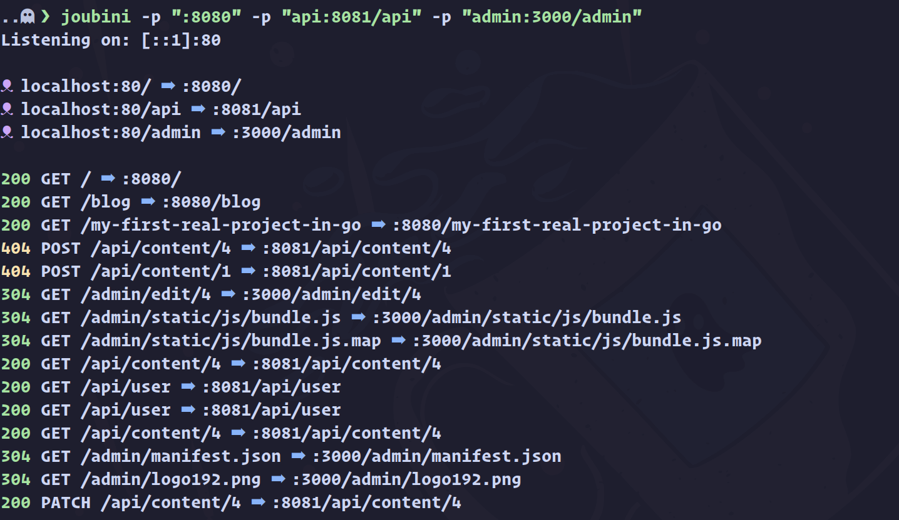

[](https://github.com/nixpig/joubini/actions/workflows/general.yml?query=branch%3Amain)
[](https://coveralls.io/github/nixpig/joubini?branch=main)

# 🐙 joubini

A super-simple and minimally configurable reverse HTTP reverse proxy for local development with support for HTTP/1.1, HTTP/2, TLS/SSL and web sockets.

## ⚠️ WORK IN PROGRESS

### todo!

- [ ] Add support for TLS/SSL.
- [ ] Add support for web sockets.
- [ ] Use a connection pool instead of recreating for every request.

**It's probably not a good idea to actually use this for anything at this point. Maybe soon 🤷**

## Features



### Notes

- The `ip:port` of the client is added to the `x-forwarded-for` header.
- Hop-by-hop headers (as defined in [RFC2616](https://datatracker.ietf.org/doc/html/rfc2616#section-13.5.1)) are removed by default.

## Usage

```shell
$ joubini --help

A super-simple and minimally configurable HTTP reverse proxy for local development with support for HTTP/1.1, HTTP/2, TLS/SSL and web sockets.

Usage: joubini [OPTIONS]

Options:
  -H, --host <host>           Hostname or IP [default: 127.0.0.1]
  -P, --port <local_port>     Local port for reverse proxy server to listen on [default: 80]
  -p, --proxy <proxy_config>  Configuration for proxy in format '</local_path?><:remote_port!></remote_path?>'
  -c, --config <config_file>  Path to configuration file
  -h, --help                  Print help
  -V, --version               Print version

```

### Note

Ordering of proxy configurations matters.

❌ This **will not** work as (probably) intended:
`joubini --proxy=myapp/api:3001/api --proxy=myapp:3000/ui`

✅ This **will** work as (probably) intended:
`joubini --proxy=myapp:3000/ui --proxy=myapp/api:3001/api`

### Config file (optional)

If a config file is provided then no other provided CLI arguments will be parsed.

Proxies defined in the config file follow the same pattern as via CLI, i.e.

`</local_path?><:remote_port!></remote_path?>`

```yaml
# joubini.yml
host: 127.0.0.1
port: 80
proxies:
  - :3000 # http://127.0.0.1 -> http://127.0.0.1:3000
  - api:3001/api # http://127.0.0.1/api -> http://127.0.0.1:3001/api
  - admin:3002/dashboard # http://127.0.0.1/admin -> http://127.0.0.1:3002/dashboard
  - db:5432 # http://127.0.0.1/db -> http://127.0.0.1:5432
```

### Examples

Some common use cases are shown below. Combinations of these and other more complex use cases can be achieved, so see the more detailed documentation.

#### Simple host to port mapping

Proxy requests for `http://127.0.0.1/*` to `http://127.0.0.1:3000/*`

```shell
joubini -p ":3000"
```

#### Host path to port mapping

Proxy requests for `http://127.0.0.1/api/*` to `http://127.0.0.1:3001/*`

```shell
joubini -p "api:3001"
```

#### Host path to port/path mapping

Proxy requests for `http://127.0.0.1/admin/*` to `http://127.0.0.1:3002/admin/*`

```shell
joubini -p "admin:3002/admin"
```

#### Combine multiple configurations

```shell
joubini -p ":3000" -p "api:3001" -p "admin:3002/admin"
```

## Installation

### Build from source

1. Install the Rust toolchain ([instructions](https://rustup.rs/))
1. `git clone https://github.com/nixpig/joubini.git`
1. `cd joubini`
1. `cargo build --release`
1. `mv ./target/release/joubini ~/.local/bin/`

### Using TLS (aka SSL, aka HTTPS) on `localhost`

1. Create a new CA and generate certificates using the included script: `bash -c scripts/ca.sh`
1. Specify the `localhost.crt` and `localhost.key` when configuring `joubini`
1. In Chrome, add the `myCA.pem` under `chrome://settings/certificates` -> Authorities

## Motivation

I just wanted an interesting little project to work on in Rust which involves some basic networking stuff and that would actually be useful.

## Alternatives

- [Caddy](https://caddyserver.com/)
- [NGINX](https://www.nginx.com/)
- [Apache (httpd)](https://httpd.apache.org/)

## Contribute

Any suggestions, feel free to open an [issue](https://github.com/nixpig/joubini/issues).

## Development

In order to bind to port 80 (or any port below 1024), you'll need to grant access to the binary to do so.

Replace `$PATH_TO_PROJECT` in command below with the _absolute_ path to the project.

```shell
sudo setcap CAP_NET_BIND_SERVICE=+eip $PATH_TO_PROJECT/target/debug/joubini

```

## License

[MIT](https://github.com/nixpig/joubini?tab=MIT-1-ov-file#readme)
